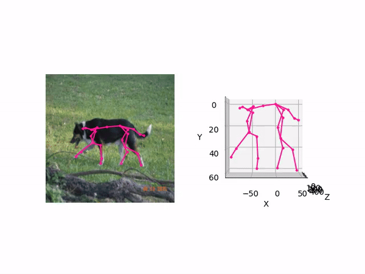

# DigiDogs: Single-View 3D Pose Estimation of Dogs using Synthetic Training Data 

### Description 
This work was presented at the "Computer Vision with Small Data: A Focus on Infants and Endangered Animals [CV4Smalls](https://cv4smalls.sites.northeastern.edu/)" workshop at WACV2024 and won the **best paper award**.

**[Paper](https://openaccess.thecvf.com/content/WACV2024W/CV4Smalls/papers/Shooter_DigiDogs_Single-View_3D_Pose_Estimation_of_Dogs_Using_Synthetic_Training_WACVW_2024_paper.pdf)** - **[FlashTalk](https://www.youtube.com/watch?v=9AVtmJYLD5I)**


 

### Environment 
Normally if you execute the following the environment installation process will work. 
Code has been used with CUDA 11.0, CudNN 8.3.2, Python 3.8 
```shell 
    git clone https://github.com/mshooter/DigiDogs_release.git
    cd DigiDogs_release
    conda env create -f environment.yaml 
    conda activate digidogs
    pip install -r requirements.txt
    # this will install the src code called digidogs 
    pip install . 
``` 

### Download 
Download the data from the following [link](https://cvssp.org/data/DigiDogs/) and modify the file to the folder in the config files in digidogs/configs/\*.yaml or follow the folder structure. 

The folder structure should look like this, so if directories are not created after git cloning, then please do create them e.g. logs, checkpoints:
```bash
DigiDogs_release
├── checkpoints
│   └── ...
├── logs
│   └── ...
├── configs
│   ├── train_digidogs.yaml
│   ├── test_digidogs.yaml
│   ├── test_stanext.yaml
├── data
│   ├── vis_images
├── scripts
│   └── demo.py
│   └── launch.py
├── digidogs
│   └── configs
│   └── datasets
│   └── models
│   └── rgbddog
│   └── utils
```

### Demo/Inference 
We are showing our method on internet images. 
We already have put images in the folder, but if you want to do inference on your images:
    1. Please put your images in the folder data/vis_images
The argument is: the image path to images to the images you want to apply the method to
Argument "custom" needs to be put, indicating it is custom images.. 
For example:
```shell
    python script/demo.py custom DigiDogs_release/data/
```

If you need to change the checkpoints, there are several checkpoints available in the checkpoint folder: 
- one trained with the DigiDogs dataset (gta) 
- one trained with the RGBDDog dataset (rgbd)
- one trained with the SVM dataset (svm) 
Please change line \#64 in scripts/demo.py  

The RGBD-Dog and the GTA will return a complete skeleton, while the svm will only return some keypoints from one point of view. 

### Training and testing 
- Check inside the bash files how we run the script, for training and testing
- Please change the "data_dir" variable in the \*.yaml files, to where your dataset is located 
- If you want to adapt parameters etc. you can modify the config file in digidogs/configs/ and the parameters in the bash files
```
Bash train.sh
```

### Common issues 
If you are having the below error:
```
AttributeError: partially initialized module 'cv2' has no attribute 'gapi_wip_gst_GStreamerPipeline' (most likely due to a circular import)
```
Please do the following:
```
pip uninstall opencv-python 
pip uninstall opencv-contrib-python
pip uninstall opencv-python-headless

pip install opencv-python 
pip install opencv-contrib-python
pip install opencv-python-headless
```

## TODO: 
- [ ] Release test code. 

## Citation
```
@InProceedings{Shooter_2024_WACV,
author = {Shooter, Moira and Malleson, Charles and Hilton, Adrian},
title = {DigiDogs: Single-View 3D Pose Estimation of Dogs Using Synthetic Training Data},
booktitle = {Proceedings of the IEEE/CVF Winter Conference on Applications of Computer Vision (WACV) Workshops},
month = {January},
year = {2024},
pages = {80-89}
}
```

## Contact information 
Please contact [Moira Shooter](m.shooter@surrey.ac.uk) for enquiries

